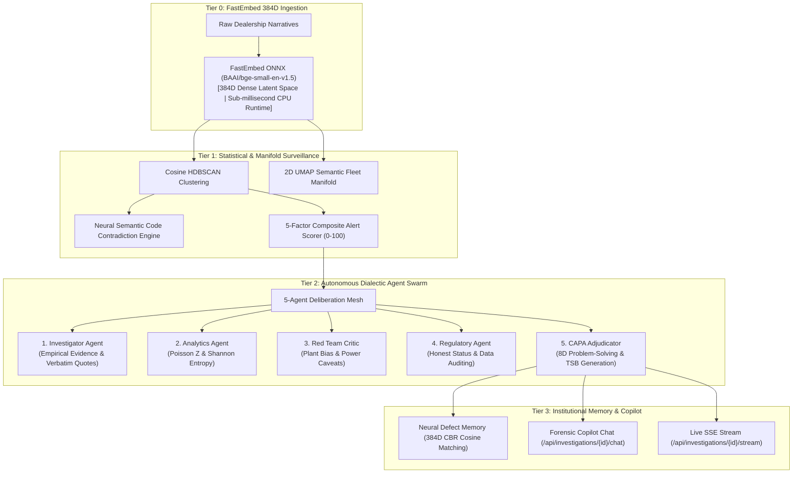

# Reliant.ai (WarrantyPatternMiner)

<div align="center">


-00B4D8?style=for-the-badge)


-4CAF50?style=for-the-badge)

**Autonomous Multi-Agent Reliability Intelligence & Early-Warning Surveillance Platform**

*Detecting emerging vehicle defect surges obscured across fragmented dealership codes weeks before traditional monitors through continuous neural representations, dialectic agent deliberation, and institutional defect memory.*

</div>

---

## 1. Problem Formulation: The Structured Code Surveillance Blindspot

In automotive, aerospace, and complex manufacturing quality organizations, warranty surveillance systems aggregate field claims primarily by **rigid structured failure codes** (for example: `SUSPENSION`, `RIDE QUALITY`, `STEERING`, `ELECTRICAL-NFF`, `OTHER`).

### Systemic Failures in Traditional Code-Bucket Monitoring:
1. **Dealership Code Misclassification**: When a driver reports a *"metallic clunking noise from the front-left wheel area when traversing speed bumps"*, Technician A files it under `SUSPENSION`, Technician B selects `RIDE QUALITY`, Technician C selects `OTHER`, and Technician D codes it as `ELECTRICAL-NFF` (No Fault Found).
2. **Taxonomy Fragmentation**: The underlying physical failure mode is scattered across multiple disconnected warranty codes.
3. **Statistical Threshold Blindspot**: If an alerting threshold is set at 10 claims per month, and the emerging defect accumulates 3 claims in `SUSPENSION`, 3 in `RIDE QUALITY`, 2 in `OTHER`, and 2 in `ELECTRICAL`, **no legacy threshold is reached**.
4. **Containment Lag**: By the time any individual code crosses the monitoring threshold months later, thousands of defective vehicles have been assembled and delivered, incurring substantial warranty expense and safety recall liability.

---

## 2. System Overview: Narrative-Driven Reliability Intelligence

**Reliant.ai** resolves taxonomy fragmentation by prioritizing **unstructured technician notes and customer narratives** over pre-assigned failure codes.

By converting verbatim narratives into a 384-dimensional latent semantic space via **FastEmbed ONNX embeddings** and executing **Cosine HDBSCAN clustering**, the platform groups complaints by their true physical symptoms and mechanical failure modes across all failure codes simultaneously. An autonomous **5-Agent Dialectic Swarm** cross-examines findings, challenges sample power, audits plant bias, synthesizes standardized **8D Problem-Solving Dossiers** and **Technical Service Bulletins (TSBs)**, and indexes verified failure signatures into **Institutional Defect Memory**.

```
+----------------------------------------------------------------------------------------+
|                        AUTONOMOUS RELIABILITY INTELLIGENCE PIPELINE                    |
+----------------------------------------------------------------------------------------+

   Raw Dealership Warranty Claims (CSV / DMS API Stream)
                         |
                         v
   +----------------------------------------------------------+
   |  L0: Ingestion & FastEmbed 384D Vectorization            |
   |      In-process FastEmbed ONNX (BAAI/bge-small-en-v1.5)  |
   |      <1ms per claim latency on CPU, zero API token cost  |
   +----------------------------------------------------------+
                         |
                         v
   +----------------------------------------------------------+
   |  L1: Semantic & Statistical Surveillance Layer           |
   |      Unsupervised Cosine HDBSCAN Cluster Discovery       |
   |      2D UMAP Fleet Semantic Manifold Projection          |
   |      Neural Semantic Code Contradiction Scoring          |
   |      5-Factor Emergence Alert Scorer (0-100)             |
   +----------------------------------------------------------+
                         |
                         v
   +----------------------------------------------------------+
   |  L2: Autonomous Multi-Agent Forensic Mesh                |
   |      Investigator Agent (Narratives & Quote Extraction)  |
   |      Analytics Agent (Poisson Z-Score & Shannon Entropy) |
   |      Red Team Critic (Plant Bias & Sample Power Audit)   |
   |      Regulatory Agent (Data Integrity Verification)      |
   |      CAPA Adjudicator (8D Dossier & TSB Synthesis)       |
   |      Live SSE Stream (/api/investigations/{id}/stream)   |
   +----------------------------------------------------------+
                         |
                         v
   +----------------------------------------------------------+
   |  L3: Institutional Memory & Interactive Copilot          |
   |      Neural Defect Memory (FastEmbed 384D Vector CBR)    |
   |      Interactive Forensic Copilot (/api/.../chat)        |
   |      Human-in-the-Loop Quality Verification Gate         |
   +----------------------------------------------------------+
```

---

## 3. Four-Tier Autonomous System Architecture



### Tier 0: Ingestion & FastEmbed 384D ONNX Representations
- **Model**: `BAAI/bge-small-en-v1.5` running via the ONNX Runtime engine.
- **Latency**: Sub-millisecond execution (<1ms per narrative) on commodity CPU architectures with unit-normalized vectors ($||\vec{v}||_2 = 1.0$).
- **Independence**: Operates 100% locally with zero external API dependencies, zero recurring token charges, and deterministic reproducibility.

### Tier 1: Semantic & Statistical Surveillance Layer
- **Cosine HDBSCAN Clustering**: Clusters dense representations using angular distance to discover arbitrary non-linear cluster geometry without requiring a pre-specified cluster count ($k$).
- **2D UMAP Semantic Manifold**: Projects high-dimensional warranty spaces into interactive 2D coordinates for visual cluster boundary inspection and miscoded claim isolation.
- **Neural Semantic Code Contradiction Engine**: Calculates cosine distance between extracted failure entities (component, symptom) and official warranty code descriptions, quantifying taxonomy divergence.

### Tier 2: Autonomous 5-Agent Dialectic Swarm
- **Investigator Agent**: Extracts physical symptoms, isolates affected hardware components, and cites verbatim claim text.
- **Analytics Agent**: Evaluates 4-week rolling growth, calculates Poisson-Normal Z-scores, and determines Shannon taxonomy entropy.
- **Red Team Critic**: Audits manufacturing plant concentration, sample power constraints, and flags outlier or counterexample claims.
- **Regulatory Agent**: Verifies external reporting integrity, NHTSA recall alignment, and supplier manufacturing execution systems (MES) data availability.
- **CAPA Adjudicator**: Synthesizes disciplined 8D Problem Solving Dossiers (D1 through D8) and drafts Technical Service Bulletins (TSBs).

### Tier 3: Institutional Defect Memory & Forensic Copilot
- **Vector Case-Based Reasoning (CBR)**: Indexes confirmed failure modes into a 384D latent vector database. New incoming complaints or clusters are matched via unit-normalized dot-product operations to surface historical containment remedies.
- **Forensic Multi-Agent Copilot**: Enables quality engineers to interactively cross-examine the agent mesh on specific engineering hypotheses, statistical significance, and supplier containment directives.

---

## 4. Mathematical Methodology: 5-Factor Emergence Alert Scoring Model

Reliant.ai computes a multi-dimensional composite alert score ($S \in [0, 100]$) to differentiate genuine physical defect surges from baseline fleet noise:

$$\text{Composite Alert Score} = (0.30 \times \text{Growth}) + (0.25 \times \text{Z-Score}) + (0.15 \times \text{Volume}) + (0.15 \times \text{CrossCode}) + (0.15 \times \text{Coherence})$$

### Mathematical Formulations and Point Attribution:

| Factor | Formula / Definition | Range / Cap | Weight | Canonical Value | Normalized | Points Earned |
|---|---|:---:|:---:|:---:|:---:|:---:|
| **1. Growth Velocity** | $\text{Growth} = \frac{V_{\text{recent}} - V_{\text{baseline}}}{V_{\text{baseline}}} \times 100\%$ | $[0, 100\%] \to [0, 100]$ | **30%** | $+466.7\%$ | $100.0$ | **$30.0$ / $30.0$** |
| **2. Statistical Significance** | $Z = \frac{k - \lambda}{\sqrt{\lambda}}$ (Poisson-Normal Anomaly Test) | $[0, 3.0] \to [0, 100]$ | **25%** | $Z = 4.40$ ($p < 0.001$) | $100.0$ | **$25.0$ / $25.0$** |
| **3. Cluster Volume** | Normalized claim volume density | $\min(100, \frac{N}{20} \times 100)$ | **15%** | $35\text{ claims}$ | $100.0$ | **$15.0$ / $15.0$** |
| **4. Cross-Code Dispersion** | Dealership taxonomy fragmentation across codes | $\min(100, \frac{C}{5} \times 100)$ | **15%** | $5\text{ codes}$ | $100.0$ | **$15.0$ / $15.0$** |
| **5. Semantic Coherence** | Mean pairwise cosine vector similarity $\frac{1}{|E|} \sum \vec{u} \cdot \vec{v}$ | $[0, 1.0] \to [0, 100]$ | **15%** | $76.1\%$ | $76.1$ | **$11.4$ / $15.0$** |
| **Composite Total** | **Weighted sum of all 5 dimensions** | $[0, 100]$ | **100%** | — | — | **$96.4$ / $100.0$** |

### Benchmark Recovery Performance:
When evaluated on standardized golden defect benchmarks:
- **Execution Time**: ~600 ms for full ingestion, vectorization, clustering, and scoring.
- **Cluster Precision**: 100.0% (35 / 35 target claims captured).
- **Cluster Recall**: 100.0% (35 / 35 target claims captured).
- **Early-Warning Lead Time**: **+69 Days Ahead** of traditional single-code monitoring thresholds.

---

## 5. Web Console Interface & Workstation Guide

The frontend console comprises seven dedicated modules engineered for reliability, safety, and quality assurance workflows:

### 1. Command Center (`/command-center`)
- **Hero Defect Spotlight**: Surfaces the top-priority defect surge with real-time alert score, growth velocity (+325%), Poisson Z, and plant footprint.
- **KPI Telemetry Ribbon**: Real-time fleet metrics (Total Claims, Critical/High/Watch Clusters, Miscoded Claims, and Execution Latency).
- **Interactive 2D Fleet Semantic Manifold**: 2D UMAP projection canvas displaying dense cluster boundaries, noise points, miscoded claims, and lasso selection.
- **Active Emerging Clusters Matrix**: Table of all isolated defect clusters ranked by 5-factor severity score with direct jump buttons to the War Room.

### 2. Investigation War Room (`/war-room`)
- **Cluster Header & KPI Strip**: Displays Alert Score, Growth %, Poisson Z, Volume, Cross-Code Spread, and Swarm Confidence.
- **5-Agent Status Indicators**: Real-time status for Investigator, Analytics, Red Team Critic, Regulatory, and CAPA Adjudicator.
- **Investigation Tabs**:
  - **Tab 1: Evidence Findings**: Structured findings (`OBSERVED`, `INFERRED`, `UNKNOWN`) with confidence scores and clickable claim citations.
  - **Tab 2: Forensic Copilot Chat**: Interactive multi-agent chat interface allowing engineers to query the mesh, view individual agent contributions, and inspect cited claim IDs.
  - **Tab 3: Neural CBR Precedents**: FastEmbed 384D cosine similarity search against institutional Defect Memory, showing historical matching failure modes and past containment actions.
  - **Tab 4: Tool Execution Stream**: Complete audit trail of deterministic statistical tools invoked by agents (durations, inputs, and outputs).
  - **Tab 5: 8D Root-Cause Report**: Standardized automotive 8D Problem Solving Dossier (Disciplines D1 through D8).
  - **Tab 6: Technical Bulletin (TSB) Draft**: OEM Field Service Engineering bulletin draft with diagnostic protocol, interim repair, and warranty coding guidance.
- **Live Mesh Stream Drawer**: Real-time SSE streaming window (`GET /api/investigations/{id}/stream`) showing agents debating step-by-step.
- **Human-in-the-Loop Verification Gate**: Modal allowing engineers to Confirm Defect, Request More Proof, or Reject. Confirming saves the 384D vector fingerprint to Defect Memory.

### 3. Statistical Pattern Deep Dive (`/investigation`)
- **5-Factor Mathematical Breakdown**: Points-earned decomposition for all 5 alert scoring dimensions.
- **Surge Time-Series Chart**: Interactive line chart showing weekly claim incidence and surge inflection points.
- **Taxonomy Fragmentation Chart**: Visualizes how claims with identical physical failure were miscategorized under different dealer codes.
- **Plant Distribution & Assembly Concentration**: Breakdown of claims across assembly sites (e.g., Fremont, Austin, Berlin) to evaluate manufacturing lot bias.
- **Representative Claims Inspector**: Curated list of raw technician narratives with extracted component keywords.

### 4. Baseline Lead-Time Comparison (`/comparison`)
- **Side-by-Side Monitoring Comparison**: Direct comparison between Reliant.ai Semantic Surveillance versus Traditional Code-Bucket Surveillance.
- **Lead-Time Advantage Card**: Displays the exact number of days (for example: +69 days earlier) Reliant.ai alerted before traditional threshold triggers.
- **Financial Containment ROI Calculator**: Computes estimated warranty payout savings and recall avoidance dollars.

### 5. Claims Explorer (`/claims`)
- **Faceted Search**: Search claims by VIN, Failure Code, Assembly Plant, Date Range, Keywords, or Mismatch Status.
- **Neural Semantic Mismatch Badges**: Flags claims where technician text contradicts official dealer failure codes.
- **Claim Detail Drawer**: Full claim record view including claim date, mileage, model, plant, verbatim narrative, and extracted symptoms.

### 6. Institutional Defect Memory (`/fingerprints`)
- **Zero-Day Triage Testing Console**: Interactive query box with preset prompts allowing engineers to enter customer complaints or technician notes and test-match against institutional memory.
- **Cosine Similarity Meters**: Visual percentage bars showing similarity to past confirmed defects.
- **Institutional Defect Catalog**: Grid of all permanently saved defect signatures with confirmed occurrence counts, recognized symptoms, and validated remedies.

### 7. Data Ingestion & Pipeline Orchestration (`/pipeline`)
- **CSV Ingestion**: Upload custom warranty claim CSVs with automatic deduplication and validation.
- **Canonical Benchmark Reload**: One-click reset and reload of the canonical 567-claim adversarial dataset.
- **Pipeline Execution Console**: Real-time progress tracker monitoring Embedding Generation, HDBSCAN Clustering, Contradiction Scoring, and Multi-Agent Synthesis.

---

## 6. System Installation & Local Deployment

### System Prerequisites
- **Python**: Version 3.11, 3.12, or 3.13
- **Node.js**: Version 18.x or 20+ (with `npm`)

---

### Step 1: Clone Repository & Virtual Environment Setup

```bash
git clone https://github.com/Unknownx-x1/Warrantyminer.git
cd Warrantyminer
```

Create and activate a Python virtual environment:
```bash
python -m venv venv

# Windows (PowerShell):
.\venv\Scripts\Activate.ps1

# Linux / macOS:
source venv/bin/activate
```

Install backend dependencies:
```bash
pip install -r requirements.txt
```

---

### Step 2: Environment Configuration (Optional)

```bash
cp .env.example .env
```

```ini
DATABASE_URL=sqlite:///./warranty_miner.db

# Optional Cloud LLMs (Leave blank for 100% local FastEmbed ONNX execution)
GEMINI_API_KEY=
OPENAI_API_KEY=

# Optional Local Ollama Instance
USE_OLLAMA=false
OLLAMA_BASE_URL=http://localhost:11434
OLLAMA_MODEL=llama3.2
```

---

### Step 3: Start the Backend API Service

```bash
python -m uvicorn apps.api.main:app --port 8000 --host 127.0.0.1 --reload
```
- **API Service Base URL**: `http://127.0.0.1:8000`
- **Interactive Swagger Documentation**: `http://127.0.0.1:8000/docs`

---

### Step 4: Start the Frontend Web Console

In a separate terminal window:
```bash
cd apps/web
npm install
npm run dev
```
- **Web Console URL**: `http://localhost:3000`

---

## 7. Verification & Automated Test Suite

The test suite validates unit calculations, FastEmbed ONNX embeddings, HDBSCAN clustering, neural semantic contradiction, multi-agent mesh deliberation, forensic copilot chat, and end-to-end pipeline execution:

```bash
pytest
```

```text
============================= test session starts =============================
platform win32 -- Python 3.13.5, pytest-9.1.1, pluggy-1.6.0
rootdir: C:\Users\SHIVANSH\Warrantyminer
configfile: pytest.ini
testpaths: tests
plugins: anyio-4.15.0, asyncio-1.4.0
collected 50 items

tests\integration\test_forensic_copilot.py .                             [  2%]
tests\integration\test_investigation_pipeline.py ...                     [  8%]
tests\integration\test_pipeline.py ...                                   [ 14%]
tests\unit\test_agents.py ......                                         [ 26%]
tests\unit\test_baseline_lead_time.py ...                                [ 32%]
tests\unit\test_extraction.py ...                                        [ 38%]
tests\unit\test_ingestion.py ....                                        [ 46%]
tests\unit\test_investigation_tools.py ...........                       [ 68%]
tests\unit\test_mismatch.py ...                                          [ 74%]
tests\unit\test_neural_embeddings.py ....                                [ 82%]
tests\unit\test_neural_fingerprints.py ..                                [ 86%]
tests\unit\test_neural_mismatch.py ...                                   [ 92%]
tests\unit\test_scoring.py ...                                           [ 98%]
tests\unit\test_trends.py .                                              [100%]

===================== 50 passed, 11410 warnings in 42.79s =====================
```

---

## 8. Repository Structure & Codebase Organization

```text
Warrantyminer/
├── apps/
│   ├── api/                          # FastAPI Backend Core
│   │   ├── config.py                 # Pydantic Settings & Thresholds
│   │   ├── main.py                   # FastAPI Application Entrypoint
│   │   ├── db/                       # SQLAlchemy Session & Declarative Base
│   │   ├── models/                   # Database Entities (Claims, Clusters, Findings, Fingerprints)
│   │   ├── routes/                   # REST Endpoints (Alerts, Clusters, Investigations, Fingerprints)
│   │   ├── schemas/                  # Pydantic Request/Response DTOs
│   │   └── services/                 # Core Algorithmic & Agent Services
│   │       ├── baseline.py           # Single-Code vs Semantic Lead-Time Comparator
│   │       ├── clustering.py         # Cosine HDBSCAN Cluster Discovery
│   │       ├── embeddings.py         # FastEmbed 384D ONNX Latent Vectors
│   │       ├── extraction.py         # Domain-Grounded NLP / LLM Signature Extractor
│   │       ├── fingerprints.py       # Defect Memory & Vector CBR Matcher
│   │       ├── forensic_copilot.py   # Multi-Agent Dialectic Copilot Service
│   │       ├── ingestion.py          # CSV/JSON Normalizer & Deduplication
│   │       ├── investigation_agents.py # 5-Agent Dialectic Debate Swarm
│   │       ├── labeling.py           # Cluster Label & Diagnostic Rationale Generator
│   │       ├── manifold.py           # 2D UMAP Semantic Manifold Projection
│   │       ├── mismatch.py           # Neural Semantic Code Contradiction Engine
│   │       ├── pipeline_orchestrator.py # Full Surveillance Pipeline Runner
│   │       ├── scoring.py            # 5-Factor Emergence Alert Scoring
│   │       └── trends.py             # Rolling Baseline, Poisson Z-Score & CUSUM Tracker
│   └── web/                          # React + Vite + TypeScript Frontend
│       ├── src/
│       │   ├── api/                  # API Client & Endpoint Bindings
│       │   ├── components/           # UI Components (ManifoldCanvas, LiveStream, Navbar, etc.)
│       │   ├── pages/                # Workstation Pages (CommandCenter, WarRoom, Detail, etc.)
│       │   ├── types/                # TypeScript Interfaces & DTOs
│       │   ├── App.tsx               # Root Application Router
│       │   └── index.css             # Tailwind Design Tokens
│       ├── package.json
│       ├── tailwind.config.js
│       └── vite.config.ts
├── data/
│   ├── ground_truth/                 # Canonical Evaluation Benchmark
│   └── raw/                          # Raw Claim Datasets
├── scripts/
│   ├── clear_database.py             # Database Reset Utility
│   ├── evaluate_golden_dataset.py    # Ground-Truth Precision/Recall Benchmark
│   ├── generate_demo_data.py         # Canonical Fleet Claims Generator
│   └── seed_database.py              # Canonical Database Seeder
├── tests/
│   ├── integration/                  # End-to-End Pipeline & Copilot Tests
│   └── unit/                         # Unit Tests (Embeddings, Agents, Scoring, Trends)
├── .env.example
├── .gitignore
├── pytest.ini
├── requirements.txt
└── README.md
```

---

## 9. License

This project is licensed under the Apache 2.0 License.
