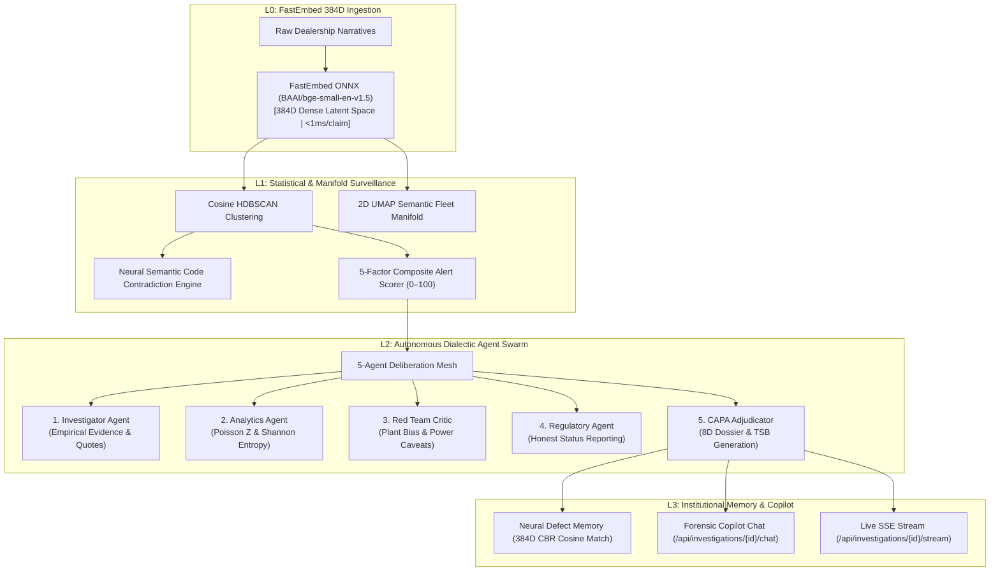

# Reliant.ai (WarrantyPatternMiner)

<div align="center">


-00B4D8?style=for-the-badge)


-4CAF50?style=for-the-badge)

**Autonomous Multi-Agent Reliability Intelligence & Early-Warning Surveillance Platform**

*Catching emerging vehicle defect surges obscured across fragmented dealership codes weeks before traditional monitors — backed by continuous neural representations, dialectic agent deliberation, and institutional defect memory.*

</div>

---

## 📌 The Problem: The Legacy Surveillance Blindspot

In the automotive, aerospace, and heavy manufacturing sectors, legacy warranty surveillance relies heavily on **rigid, structured failure codes** (e.g., `SUSPENSION`, `RIDE QUALITY`, `STEERING`, `ELECTRICAL-NFF`, `OTHER`).

### Why Traditional Code-Bucket Monitoring Fails:
1. **Dealership Code Misclassification**: When a driver reports a *"metallic clunking noise from the front-left wheel area when traversing speed bumps"*, Technician A files it under `SUSPENSION`, Technician B selects `RIDE QUALITY`, Technician C selects `OTHER`, and Technician D codes it as `ELECTRICAL-NFF` (No Fault Found).
2. **Taxonomy Fragmentation**: The single physical failure mode is scattered across 5+ disconnected warranty buckets.
3. **Threshold Blindspot**: If an alerting threshold is 10 claims/month, but the defect accumulates 3 in `SUSPENSION`, 3 in `RIDE QUALITY`, 2 in `OTHER`, and 2 in `ELECTRICAL`, **no legacy alarm fires**.
4. **Catastrophic Containment Delay**: By the time any individual code crosses the threshold months later, thousands of defective vehicles have shipped, incurring millions in warranty and recall costs.

---

## 💡 The Solution: Reliant.ai

**Reliant.ai** bypasses misleading checkbox classifications by continuously analyzing the **unstructured technician and customer narratives**. 

By projecting narratives into a 384-dimensional latent vector space using local **FastEmbed ONNX embeddings** and clustering via **Cosine HDBSCAN**, the platform unites fragmented complaints into true physical defect signatures. An autonomous **5-Agent Dialectic Swarm** investigates the root causes, cross-examines evidence, generates standardized **8D Problem-Solving Dossiers** and **Technical Service Bulletins (TSBs)**, and indexes verified signatures into **Neural Defect Memory**.

```
┌────────────────────────────────────────────────────────────────────────────────────────┐
│                        AUTONOMOUS RELIABILITY INTELLIGENCE PIPELINE                    │
└────────────────────────────────────────────────────────────────────────────────────────┘

   Raw Dealership Warranty Claims (CSV / DMS API Stream)
                         │
                         ▼
   ┌──────────────────────────────────────────────────────────┐
   │  L0: High-Speed Ingestion & FastEmbed 384D Vectorization │
   │     • In-process FastEmbed ONNX (BAAI/bge-small-en-v1.5) │
   │     • <1ms per claim latency on CPU, 0 token costs       │
   └──────────────────────────────────────────────────────────┘
                         │
                         ▼
   ┌──────────────────────────────────────────────────────────┐
   │  L1: Semantic & Statistical Surveillance Layer           │
   │     • Unsupervised Cosine HDBSCAN Cluster Discovery      │
   │     • 2D UMAP Fleet Semantic Manifold Projection         │
   │     • Neural Semantic Code Contradiction Scoring         │
   │     • Transparent 5-Factor Emergence Alert Scorer (0-100)│
   └──────────────────────────────────────────────────────────┘
                         │
                         ▼
   ┌──────────────────────────────────────────────────────────┐
   │  L2: Autonomous Multi-Agent Forensic Mesh                │
   │     • Investigator Agent (Narratives & Quote Extraction) │
   │     • Analytics Agent (Poisson Z-Score & Shannon Entropy)│
   │     • Red Team Critic (Plant Bias & Sample Power Audit)  │
   │     • Regulatory Agent (NHTSA / MES Data Availability)   │
   │     • CAPA Adjudicator (8D Dossier & TSB Synthesis)      │
   │     • Live SSE Stream (/api/investigations/{id}/stream)  │
   └──────────────────────────────────────────────────────────┘
                         │
                         ▼
   ┌──────────────────────────────────────────────────────────┐
   │  L3: Institutional Memory & Interactive Copilot          │
   │     • Neural Defect Memory (FastEmbed 384D Vector CBR)   │
   │     • Interactive Forensic Copilot (/api/.../chat)       │
   │     • Human-in-the-Loop Quality Verification Gate        │
   └──────────────────────────────────────────────────────────┘
```

---

## 🤖 4-Tier Autonomous Intelligence Architecture



---

## 🔬 The 5-Factor Emergence Alert Scoring Model

Reliant.ai uses a transparent, multi-dimensional composite scoring function ($S \in [0, 100]$) to differentiate true emerging safety surges from random noise:

$$\text{Composite Alert Score} = (0.30 \times \text{Growth}) + (0.25 \times \text{Z-Score}) + (0.15 \times \text{Volume}) + (0.15 \times \text{CrossCode}) + (0.15 \times \text{Coherence})$$

### Point Attribution Decomposition:

| # | Factor | Methodology & Benchmark | Weight | Canonical Value | Points Earned |
|---|---|---|:---:|:---:|:---:|
| **1** | **Growth Velocity** | 4-week rolling surge vs. 6-month historical baseline ($>100\%$ = max) | **30%** | $+466.7\%$ | **$30.0$ / $30.0$** |
| **2** | **Statistical Significance** | Poisson-Normal Z-Score significance test ($Z \ge 2.86 \implies p < 0.001$) | **25%** | $Z = 4.40$ | **$25.0$ / $25.0$** |
| **3** | **Cluster Volume** | Consolidated fleet-wide claim count ($\ge 20$ claims = max) | **15%** | $35\text{ claims}$ | **$15.0$ / $15.0$** |
| **4** | **Cross-Code Dispersion** | Dealership taxonomy fragmentation ($\ge 5$ codes = max) | **15%** | $5\text{ codes}$ | **$15.0$ / $15.0$** |
| **5** | **Semantic Coherence** | Mean pairwise cosine similarity across latent vectors | **15%** | $76.1\%$ | **$11.4$ / $15.0$** |
| $\sum$ | **Composite Total** | **Sum of all 5 dimensions** | **100%** | — | **$96.4$ / $100.0$** |

---

## 🖥️ Frontend Web Console Tour

The application provides **7 industrial-grade workstations**:

### 1. Command Center (`/command-center`)
* **Hero Defect Spotlight**: Surfaces the top-priority defect surge with real-time alert score, growth velocity (+325%), Poisson Z, and plant footprint.
* **KPI Telemetry Ribbon**: Real-time fleet metrics (Total Claims, Critical/High/Watch Clusters, Miscoded Claims, and Execution Latency).
* **Interactive 2D Fleet Semantic Manifold**: 2D UMAP projection canvas with cluster convex hulls, noise points, miscoded claim badges, and interactive bounding-box lasso selection.
* **Active Emerging Clusters Matrix**: Table of all isolated defect clusters ranked by 5-factor severity score with direct jump buttons to the War Room.

### 2. Investigation War Room (`/war-room`)
* **Cluster Header & KPI Strip**: Displays Alert Score, Growth %, Poisson Z, Volume, Cross-Code Spread, and Swarm Confidence.
* **5-Agent Live Status Indicators**: Real-time status for Investigator, Analytics, Red Team Critic, Regulatory, and CAPA Adjudicator.
* **Six Deep-Dive Investigation Tabs**:
  * **Tab 1: Evidence Findings**: Structured findings (`OBSERVED`, `INFERRED`, `UNKNOWN`) with confidence scores and clickable claim citations.
  * **Tab 2: Forensic Copilot Chat**: Interactive multi-agent chat interface allowing engineers to query the mesh, view individual agent contributions, and inspect cited claim IDs.
  * **Tab 3: Neural CBR Precedents**: FastEmbed 384D cosine similarity search against institutional Defect Memory, showing historical matching failure modes and past containment actions.
  * **Tab 4: Tool Execution Stream**: Complete audit trail of deterministic statistical tools invoked by agents (durations, inputs, and outputs).
  * **Tab 5: 8D Root-Cause Report**: Standardized automotive 8D Problem Solving Dossier (Disciplines D1 through D8).
  * **Tab 6: Technical Bulletin (TSB) Draft**: OEM Field Service Engineering bulletin draft with diagnostic protocol, interim repair, and warranty coding guidance.
* **Live Mesh Stream Drawer**: Real-time SSE streaming window (`GET /api/investigations/{id}/stream`) showing agents debating step-by-step.
* **Human-in-the-Loop Verification Gate**: Modal allowing engineers to **Confirm Defect**, **Request More Proof**, or **Reject**. Confirming saves the 384D vector fingerprint to Defect Memory.

### 3. Statistical Pattern Deep Dive (`/investigation`)
* **5-Factor Mathematical Breakdown**: Points-earned decomposition for all 5 alert scoring dimensions.
* **Surge Time-Series Chart**: Interactive line chart showing weekly claim incidence and surge inflection points.
* **Taxonomy Fragmentation Chart**: Visualizes how claims with identical physical failure were miscategorized under different dealer codes.
* **Plant Distribution & Assembly Concentration**: Breakdown of claims across assembly sites (e.g., Fremont, Austin, Berlin) to evaluate manufacturing lot bias.
* **Representative Claims Inspector**: Curated list of raw technician narratives with extracted component keywords.

### 4. Baseline Lead-Time Comparison (`/comparison`)
* **Side-by-Side Monitoring Comparison**: Direct comparison between **Reliant.ai Semantic Surveillance** vs. **Traditional Code-Bucket Surveillance**.
* **Lead-Time Advantage Card**: Displays the exact number of days (e.g., **+69 days earlier**) Reliant.ai alerted before traditional threshold triggers.
* **Financial Containment ROI Calculator**: Computes estimated warranty payout savings and recall avoidance dollars.

### 5. Claims Explorer (`/claims`)
* **Faceted Search**: Search claims by VIN, Failure Code, Assembly Plant, Date Range, Keywords, or Mismatch Status.
* **Neural Semantic Mismatch Badges**: Flags claims where technician text contradicts official dealer failure codes.
* **Claim Detail Drawer**: Full claim record view including claim date, mileage, model, plant, verbatim narrative, and extracted symptoms.

### 6. Institutional Defect Memory (`/fingerprints`)
* **Zero-Day Triage Testing Console**: Interactive query box with preset prompts allowing engineers to enter customer complaints or technician notes and test-match against institutional memory.
* **Cosine Similarity Meters**: Visual percentage bars showing similarity to past confirmed defects.
* **Institutional Defect Catalog**: Grid of all permanently saved defect signatures with confirmed occurrence counts, recognized symptoms, and validated remedies.

### 7. Data Ingestion & Pipeline Orchestration (`/pipeline`)
* **CSV Ingestion**: Upload custom warranty claim CSVs with automatic deduplication and validation.
* **Canonical Benchmark Reload**: One-click reset and reload of the canonical 567-claim adversarial dataset.
* **Pipeline Execution Console**: Real-time progress tracker monitoring Embedding Generation, HDBSCAN Clustering, Contradiction Scoring, and Multi-Agent Synthesis.

---

## 🚀 Quickstart & Setup

### Prerequisites
* **Python**: 3.11, 3.12, or 3.13
* **Node.js**: 18.x or 20+ (with `npm`)

---

### Step 1: Clone Repository & Virtual Environment

```bash
git clone https://github.com/Unknownx-x1/Warrantyminer.git
cd Warrantyminer
```

Create and activate virtual environment:
```bash
python -m venv venv

# Windows (PowerShell):
.\venv\Scripts\Activate.ps1

# Linux / macOS:
source venv/bin/activate
```

Install backend dependencies:
```bash
pip install -r requirements.txt
```

---

### Step 2: Configure Environment (Optional)

```bash
cp .env.example .env
```

```ini
DATABASE_URL=sqlite:///./warranty_miner.db

# Optional Cloud LLMs (Leave blank for 100% local FastEmbed ONNX engine)
GEMINI_API_KEY=
OPENAI_API_KEY=

# Optional Ollama Local LLM
USE_OLLAMA=false
OLLAMA_BASE_URL=http://localhost:11434
OLLAMA_MODEL=llama3.2
```

---

### Step 3: Start the Backend API Service

```bash
python -m uvicorn apps.api.main:app --port 8000 --host 127.0.0.1 --reload
```
* **API Service**: `http://127.0.0.1:8000`
* **Swagger API Documentation**: `http://127.0.0.1:8000/docs`

---

### Step 4: Start the Frontend Web Console

In a separate terminal:
```bash
cd apps/web
npm install
npm run dev
```
* **Web Console**: `http://localhost:3000`

---

## 🧪 Testing & Verification

The test suite covers unit calculations, FastEmbed ONNX embeddings, HDBSCAN clustering, neural semantic contradiction, multi-agent mesh deliberation, forensic copilot chat, and end-to-end pipeline execution:

```bash
pytest
```

```text
============================= test session starts =============================
platform win32 -- Python 3.13.5, pytest-9.1.1, pluggy-1.6.0
rootdir: C:\Users\SHIVANSH\Warrantyminer
configfile: pytest.ini
testpaths: tests
plugins: anyio-4.15.0, asyncio-1.4.0
collected 50 items

tests\integration\test_forensic_copilot.py .                             [  2%]
tests\integration\test_investigation_pipeline.py ...                     [  8%]
tests\integration\test_pipeline.py ...                                   [ 14%]
tests\unit\test_agents.py ......                                         [ 26%]
tests\unit\test_baseline_lead_time.py ...                                [ 32%]
tests\unit\test_extraction.py ...                                        [ 38%]
tests\unit\test_ingestion.py ....                                        [ 46%]
tests\unit\test_investigation_tools.py ...........                       [ 68%]
tests\unit\test_mismatch.py ...                                          [ 74%]
tests\unit\test_neural_embeddings.py ....                                [ 82%]
tests\unit\test_neural_fingerprints.py ..                                [ 86%]
tests\unit\test_neural_mismatch.py ...                                   [ 92%]
tests\unit\test_scoring.py ...                                           [ 98%]
tests\unit\test_trends.py .                                              [100%]

===================== 50 passed, 11410 warnings in 42.79s =====================
```

---

## 📁 Repository Structure

```text
Warrantyminer/
├── apps/
│   ├── api/                          # FastAPI Backend Core
│   │   ├── config.py                 # Pydantic Settings & Thresholds
│   │   ├── main.py                   # FastAPI Application Entrypoint
│   │   ├── db/                       # SQLAlchemy Session & Declarative Base
│   │   ├── models/                   # DB Entities (Claims, Clusters, Findings, Fingerprints)
│   │   ├── routes/                   # REST Endpoints (Alerts, Clusters, Investigations, Fingerprints)
│   │   ├── schemas/                  # Pydantic Request/Response DTOs
│   │   └── services/                 # Core Algorithmic & Agent Services
│   │       ├── baseline.py           # Single-Code vs Semantic Lead-Time Comparator
│   │       ├── clustering.py         # Cosine HDBSCAN Cluster Discovery
│   │       ├── embeddings.py         # FastEmbed 384D ONNX Latent Vectors
│   │       ├── extraction.py         # Domain-Grounded NLP / LLM Signature Extractor
│   │       ├── fingerprints.py       # Defect Memory & Vector CBR Matcher
│   │       ├── forensic_copilot.py   # Multi-Agent Dialectic Copilot Service
│   │       ├── ingestion.py          # CSV/JSON Normalizer & Deduplication
│   │       ├── investigation_agents.py # 5-Agent Dialectic Debate Swarm
│   │       ├── labeling.py           # Cluster Label & Diagnostic Rationale Generator
│   │       ├── manifold.py           # 2D UMAP Semantic Manifold Projection
│   │       ├── mismatch.py           # Neural Semantic Code Contradiction Engine
│   │       ├── pipeline_orchestrator.py # Full Surveillance Pipeline Runner
│   │       ├── scoring.py            # 5-Factor Emergence Alert Scoring
│   │       └── trends.py             # Rolling Baseline, Poisson Z-Score & CUSUM Tracker
│   └── web/                          # React + Vite + TypeScript Frontend
│       ├── src/
│       │   ├── api/                  # API Client & Endpoint Bindings
│       │   ├── components/           # UI Components (ManifoldCanvas, LiveStream, Navbar, etc.)
│       │   ├── pages/                # Workstation Pages (CommandCenter, WarRoom, Detail, etc.)
│       │   ├── types/                # TypeScript Interfaces & DTOs
│       │   ├── App.tsx               # Root Application Router
│       │   └── index.css             # Tailwind Design Tokens
│       ├── package.json
│       ├── tailwind.config.js
│       └── vite.config.ts
├── data/
│   ├── ground_truth/                 # Canonical Evaluation Benchmark
│   └── raw/                          # Raw Claim Datasets
├── scripts/
│   ├── clear_database.py             # Database Reset Utility
│   ├── evaluate_golden_dataset.py    # Ground-Truth Precision/Recall Benchmark
│   ├── generate_demo_data.py         # Canonical Fleet Claims Generator
│   └── seed_database.py              # Canonical Database Seeder
├── tests/
│   ├── integration/                  # End-to-End Pipeline & Copilot Tests
│   └── unit/                         # Unit Tests (Embeddings, Agents, Scoring, Trends)
├── .env.example
├── .gitignore
├── pytest.ini
├── requirements.txt
└── README.md
```

---

## 📄 License

This project is licensed under the Apache 2.0 License.
