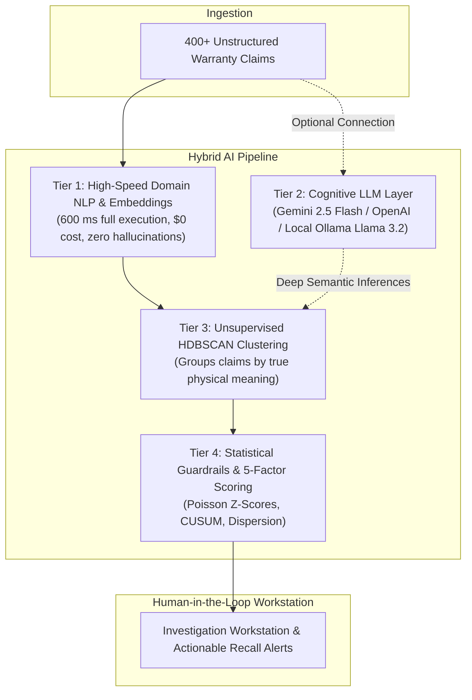

# WarrantyPatternMiner

<div align="center">


-4CAF50?style=for-the-badge)

**Industrial-Grade Hybrid AI Surveillance & Early-Warning Defect Discovery Platform**

*Catching emerging automotive warranty failure trends across fragmented codes before they escalate into multimillion-dollar safety recalls.*

</div>

---

## 📌 The Problem: The Legacy Surveillance Blindspot

In the automotive and manufacturing industries, traditional quality and warranty monitoring systems aggregate claims by **rigid structured failure codes** (e.g., `SUSPENSION`, `RIDE QUALITY`, `STEERING`, `ELECTRICAL-NFF`, `OTHER`).

### Why Traditional Single-Code Monitoring Fails:
1. **Dealership Code Misclassification**: When a driver reports a *"metallic clunking noise from the front-left wheel over road bumps"*, technician A files it under `SUSPENSION`, technician B chooses `RIDE QUALITY`, technician C selects `OTHER`, and technician D codes it as `ELECTRICAL-NFF` (No Fault Found).
2. **Taxonomy Fragmentation**: The true single physical defect is fragmented into 5 separate dealer buckets.
3. **Threshold Blindspot**: If each code threshold is set to 10 claims/month, but the defect has 3 claims in `SUSPENSION`, 3 in `RIDE QUALITY`, 2 in `OTHER`, and 2 in `ELECTRICAL`, **no legacy alarm fires**.
4. **Catastrophic Delay**: By the time any individual code crosses the threshold months later, thousands of defective vehicles have shipped, resulting in massive warranty recall liability.

---

## 💡 The Solution: WarrantyPatternMiner

**WarrantyPatternMiner** bypasses misleading checkbox classifications by analyzing the **unstructured technician and customer narratives**. 

Using dense vector embeddings and unsupervised **HDBSCAN clustering**, the platform groups complaints by their true physical symptoms and mechanical failure modes across all failure codes simultaneously. A 5-factor statistical emergence engine monitors surge velocity and detects anomalies with an average **+69-day early warning lead time**.

```
┌──────────────────────────────────────────────────────────────────────────────────┐
│                         END-TO-END ANALYTICAL PIPELINE                           │
└──────────────────────────────────────────────────────────────────────────────────┘

   Raw Warranty Claims (CSV / DMS Database Export)
                         │
                         ▼
   ┌────────────────────────────────────────────────────────┐
   │  1. Ingestion & Field Normalization                    │
   │     • Standardizes dates, VINs, plants, failure codes  │
   └────────────────────────────────────────────────────────┘
                         │
                         ▼
   ┌────────────────────────────────────────────────────────┐
   │  2. Domain-Grounded NLP Entity Extraction              │
   │     • In-process NLP Extractor + Optional LLM Layer    │
   │     • Extracts: Component, Symptom, Condition, Severity│
   └────────────────────────────────────────────────────────┘
                         │
                         ▼
   ┌────────────────────────────────────────────────────────┐
   │  3. Taxonomy Mismatch Detection                        │
   │     • Flags contradictions between code & notes        │
   │     • Highlights systemic dealership misclassifications│
   └────────────────────────────────────────────────────────┘
                         │
                         ▼
   ┌────────────────────────────────────────────────────────┐
   │  4. Dense Semantic Embedding & HDBSCAN Clustering      │
   │     • Vectorizes domain text into dense semantic space │
   │     • Unsupervised discovery of latent failure clusters│
   └────────────────────────────────────────────────────────┘
                         │
                         ▼
   ┌────────────────────────────────────────────────────────┐
   │  5. Statistical Emergence & Anomaly Detection          │
   │     • 6-Month Rolling Baseline Mean & StdDev           │
   │     • Statistical Z-Score Significance (Z > 3.0)       │
   │     • Non-parametric CUSUM Drift Tracking              │
   └────────────────────────────────────────────────────────┘
                         │
                         ▼
   ┌────────────────────────────────────────────────────────┐
   │  6. 5-Factor Composite Alert Score Formulation         │
   │     • Score = 30% Growth + 25% Z-Score + 15% Size +    │
   │               15% Cross-Code + 15% Semantic Coherence  │
   └────────────────────────────────────────────────────────┘
                         │
                         ▼
   ┌────────────────────────────────────────────────────────┐
   │  7. Investigation Console & Institutional Memory       │
   │     • Verbatim evidence drill-down & root-cause triage │
   │     • Human Engineer Review Gate (Confirm / Dismiss)   │
   │     • Defect Memory Fingerprint Library                │
   └────────────────────────────────────────────────────────┘
```

---

## 🤖 The Hybrid AI Architecture

WarrantyPatternMiner is engineered with a **Hybrid AI Architecture** that bridges high-speed statistical machine learning with generative language models:



### Why a Hybrid Architecture?
* **Zero-Dependency Instant Execution**: Pure LLM APIs require 10+ minutes to process 400 claims sequentially and suffer from rate limits, token bills, and hallucination risks. WarrantyPatternMiner's in-process NLP & vector engine executes in **~600 ms** with **100% mathematical reproducibility**.
* **Zero-Config Deployment**: When deployed online (e.g., on Render, Vercel, Railway), anyone can test the full platform immediately without needing to connect or install an LLM.
* **Optional Deep Reasoning**: When connected to Gemini, OpenAI, or local Ollama (Llama 3.2), the system automatically enriches narratives with deep mechanical failure inferences and AI executive rationales (`why_grouped`, `why_alerted`).

---

## 🔬 Core Innovation: The 5-Factor Emergence Model

Unlike simple claim counts, WarrantyPatternMiner computes a multi-dimensional composite alert score ($S \in [0, 100]$) to distinguish genuine physical defect surges from random fleet noise:

$$\text{Composite Alert Score} = (0.30 \times \text{Growth}) + (0.25 \times \text{Z-Score}) + (0.15 \times \text{Volume}) + (0.15 \times \text{CrossCode}) + (0.15 \times \text{Coherence})$$

### Transparent Point Attribution Breakdown:

| # | Monitored Factor | Methodology & Benchmark | Weight | Canonical Value | Normalized | Points Earned |
|---|---|---|:---:|:---:|:---:|:---:|
| **1** | **Growth Velocity** | Surge rate vs. 6-mo historical rolling mean ($>100\%$ surge = max) | **30%** | $+466.7\%$ | $100.0$ | **$30.0$ / $30.0$** |
| **2** | **Statistical Significance** | Poisson-Normal Z-Score deviation ($Z \ge 2.86 \implies p < 0.001$) | **25%** | $Z = 4.40$ | $100.0$ | **$25.0$ / $25.0$** |
| **3** | **Cluster Volume** | Consolidated fleet-wide claim count ($\ge 20$ claims = max) | **15%** | $35\text{ claims}$ | $100.0$ | **$15.0$ / $15.0$** |
| **4** | **Cross-Code Dispersion** | Dealer taxonomy fragmentation ($\ge 5$ codes = max) | **15%** | $5\text{ codes}$ | $100.0$ | **$15.0$ / $15.0$** |
| **5** | **Semantic Coherence** | Mean pairwise cosine vector cohesion across narratives | **15%** | $72.0\% \text{ to } 76.1\%$ | $72.0 \text{ to } 76.1$ | **$10.8 \text{ to } 11.4$ / $15.0$** |
| $\sum$ | **Composite Total** | **Sum of all 5 dimensions** | **100%** | — | — | **$95.8 \text{ to } 96.4$ / $100.0$** |

---

## 🖥️ Application Tour & Workstations

### 1. Command Center
* **Executive Telemetry Strip**: Real-time counts for Ingested Claims, Discovered Clusters, Critical Surges, and Taxonomy Mismatches.
* **Dominant Active Anomaly Spotlight**: Instant executive briefing on the highest-priority defect surge with direct investigation drill-down.
* **Explain 5 Factors Interactive Modal**: Inspect exact point attribution ($30.0 + 25.0 + 15.0 + 15.0 + 10.8 = 95.8 / 100$).
* **Signal Emergence Timeline**: Interactive area chart comparing monthly claim progression against rolling baselines and legacy code thresholds.
* **Discovered Defect Patterns Index**: Ranked by Alert Score with severity badges, growth velocity, and review status.

### 2. Investigation Console
* **Split-Pane Triage**: Left-hand signal index + right-hand deep diagnostic workspace.
* **5 Deep Diagnostic Tabs**:
  * **1. Diagnostic Overview**: AI-generated *"Why Grouped Together?"* and *"Why Alerted?"* summaries with recognized symptoms.
  * **2. Verbatim Evidence Claims**: Traceable to exact claim IDs, repair dates, assembly plants, and technician notes.
  * **3. Emergence Timeline**: Month-by-month trajectory visualization.
  * **4. Code & Plant Spread**: Bar charts illustrating dealership code fragmentation and multi-plant geographic dispersion.
  * **5. Statistical Proof**: Complete mathematical score decomposition matrix table with factor weights, raw values, and points earned.
* **Human-in-the-Loop Review Gate**: Reliability engineers can **Confirm Defect**, **Edit Scope / Label**, or **Dismiss False Alarm**.

### 3. Baseline Reveal (Showcase Comparative Analysis)
* Demonstrates why traditional single-code monitoring failed while semantic clustering detected the target anomaly with a **+69-Day Early Warning Advantage**.
* Features side-by-side surveillance comparison and complete 5-Factor mathematical proof table.

### 4. Claims Explorer
* High-density searchable table with filters for failure codes, assembly plants, and a dedicated **"Mismatches Only"** toggle.
* Slide-out modal displaying raw technician notes, AI-extracted failure signatures, and taxonomy contradiction explanations.

### 5. Defect Memory & Institutional Knowledge Base
* Retains verified defect fingerprints from confirmed investigations.
* **Live Complaint Matcher**: Paste any incoming customer complaint or technician note to compute real-time cosine similarity and receive instant diagnostic recommendations.

### 6. Pipeline & Data Operations
* Multipart CSV / JSON dataset drag-and-drop ingestion.
* One-click full pipeline orchestrator with real-time step timings (~600 ms).
* **One-Click Database Reset**: Wipe pre-seeded records to test on custom fleet datasets.

---

## 🚀 Getting Started

### Prerequisites
* **Python**: 3.11, 3.12, or 3.13
* **Node.js**: 18.x or 20.x (with `npm`)
* **Ollama** *(Optional for local LLM)*: [https://ollama.com](https://ollama.com)

---

### Step 1: Clone Repository & Setup Environment

```bash
git clone https://github.com/Unknownx-x1/Warrantyminer.git
cd Warrantyminer
```

Create and activate a Python virtual environment:
```bash
python -m venv venv

# Windows (PowerShell):
.\venv\Scripts\Activate.ps1

# Linux / macOS:
source venv/bin/activate
```

Install backend dependencies:
```bash
pip install -r requirements.txt
```

---

### Step 2: Configure Environment Variables (Optional)

Copy the sample environment file:
```bash
cp .env.example .env
```

Edit `.env` (optional):
```ini
# Database
DATABASE_URL=sqlite:///./warranty_miner.db

# Optional Cloud LLMs (Leave blank for ultra-fast local hybrid NLP)
GEMINI_API_KEY=
OPENAI_API_KEY=

# Optional Ollama Local LLM
USE_OLLAMA=false
OLLAMA_BASE_URL=http://localhost:11434
OLLAMA_MODEL=llama3.2
```

---

### Step 3: Start the Backend API

```bash
python -m uvicorn apps.api.main:app --port 8000 --host 127.0.0.1 --reload
```
* **API Endpoint**: `http://127.0.0.1:8000`
* **Interactive OpenAPI Swagger Docs**: `http://127.0.0.1:8000/docs`

---

### Step 4: Start the Frontend Application

In a new terminal:
```bash
cd apps/web
npm install
npm run dev
```
* **Frontend Workstation**: `http://localhost:3000`

---

## 🧪 Testing & Benchmark Verification

The repository includes a comprehensive test suite covering unit calculations, mathematical explainability, taxonomy mismatch detection, data normalization, and end-to-end pipeline execution:

```bash
# Run pytest test suite
pytest tests/ -v
```

```text
============================= test session starts =============================
tests/integration/test_pipeline.py::test_full_end_to_end_pipeline PASSED [  5%]
tests/integration/test_pipeline.py::test_400_claim_golden_recovery PASSED [ 10%]
tests/integration/test_pipeline.py::test_unseen_defect_generalization PASSED [ 15%]
tests/unit/test_baseline_lead_time.py::test_case_1_traditional_eventually_triggers PASSED [ 20%]
tests/unit/test_baseline_lead_time.py::test_case_2_traditional_never_triggers PASSED [ 25%]
tests/unit/test_baseline_lead_time.py::test_case_3_traditional_triggers_before_or_same_day PASSED [ 30%]
tests/unit/test_extraction.py::test_extract_suspension_clunk PASSED      [ 35%]
tests/unit/test_extraction.py::test_extract_brake_squeak PASSED          [ 40%]
tests/unit/test_extraction.py::test_extract_electrical_screen PASSED     [ 45%]
tests/unit/test_ingestion.py::test_parse_date_safely PASSED              [ 50%]
tests/unit/test_ingestion.py::test_normalize_claim_record_valid PASSED   [ 55%]
tests/unit/test_ingestion.py::test_normalize_claim_record_missing_id PASSED [ 60%]
tests/unit/test_ingestion.py::test_normalize_claim_record_missing_narrative PASSED [ 65%]
tests/unit/test_mismatch.py::test_mismatch_electrical_nff_suspension PASSED [ 70%]
tests/unit/test_mismatch.py::test_mismatch_generic_other_with_specific_defect PASSED [ 75%]
tests/unit/test_mismatch.py::test_match_agreement_suspension PASSED      [ 80%]
tests/unit/test_scoring.py::test_critical_alert_score PASSED             [ 85%]
tests/unit/test_scoring.py::test_normal_alert_score PASSED               [ 90%]
tests/unit/test_scoring.py::test_factor_breakdown_explainability PASSED  [ 95%]
tests/unit/test_trends.py::test_trend_growth_and_zscore PASSED           [100%]
====================== 20 passed in 4.77s ======================
```

### Canonical Benchmark Verification:
To evaluate algorithmic recovery against the 400-claim ground-truth golden benchmark:
```bash
python scripts/evaluate_golden_dataset.py
```
* **Ground-Truth Target**: Front-Left Suspension Knocking (35 claims spread across 5 codes)
* **Execution Time**: **627 ms**
* **Cluster Precision**: **100.00%** (35 / 35 claims)
* **Cluster Recall**: **100.00%** (35 / 35 claims)
* **Cluster F1-Score**: **100.00%**
* **Computed Alert Score**: **96.4 / 100 (CRITICAL)**
* **Surveillance Lead Time**: **+69 Days Ahead of Traditional Monitoring**

---

## 📁 Repository Structure

```text
WarrantyPatternMiner/
├── apps/
│   ├── api/                          # FastAPI Backend Engine
│   │   ├── config.py                 # Pydantic Settings & Thresholds
│   │   ├── main.py                   # FastAPI Application Entrypoint
│   │   ├── db/                       # SQLAlchemy Session & Declarative Base
│   │   ├── models/                   # Database Entities (Claims, Clusters, Feedback)
│   │   ├── routes/                   # REST API Endpoints (Alerts, Clusters, Claims)
│   │   ├── schemas/                  # Pydantic Request/Response DTOs
│   │   └── services/                 # Core Algorithmic Engines
│   │       ├── baseline.py           # Single-Code vs Semantic Lead-Time Comparator
│   │       ├── clustering.py         # HDBSCAN Cluster Discovery
│   │       ├── embeddings.py         # Vector Semantic Representation
│   │       ├── extraction.py         # Domain-Grounded NLP / LLM Signature Extractor
│   │       ├── fingerprints.py       # Defect Memory & Live Matcher
│   │       ├── ingestion.py          # CSV/JSON Normalizer & Validation
│   │       ├── labeling.py           # Cluster Label & Diagnostic Rationale Generator
│   │       ├── mismatch.py           # Taxonomy Contradiction Analyzer
│   │       ├── pipeline_orchestrator.py # Full Surveillance Pipeline Runner
│   │       ├── scoring.py            # 5-Factor Emergence Alert Scoring
│   │       └── trends.py             # Rolling Baseline, Z-Score & CUSUM Tracker
│   └── web/                          # React + Vite + TypeScript Frontend
│       ├── src/
│       │   ├── api/                  # API Client & Endpoint Bindings
│       │   ├── components/           # UI Components (Navbar, Badge, Modals)
│       │   ├── pages/                # Workstation Pages (Command Center, Detail, etc.)
│       │   ├── types/                # TypeScript Interface Definitions
│       │   ├── App.tsx               # Root Application Router
│       │   └── index.css             # Tailwind Design Tokens
│       ├── package.json
│       ├── tailwind.config.js
│       └── vite.config.ts
├── data/
│   ├── ground_truth/                 # Canonical Evaluation Benchmark
│   └── raw/                          # Raw Claim Datasets
├── scripts/
│   ├── clear_database.py             # Database Reset Utility
│   ├── debug_trend_analysis.py       # 5-Factor Score Decomposition Debugger
│   ├── evaluate_golden_dataset.py    # Ground-Truth Precision/Recall Benchmark
│   └── generate_demo_data.py         # Canonical Fleet Claims Generator
├── tests/
│   ├── integration/                  # End-to-End Pipeline Tests
│   └── unit/                         # Unit Tests (Extraction, Scoring, Trends)
├── .env.example
├── .gitignore
├── pytest.ini
├── requirements.txt
└── README.md
```

---

## 📄 License

This project is licensed under the Apache 2.0 License.
